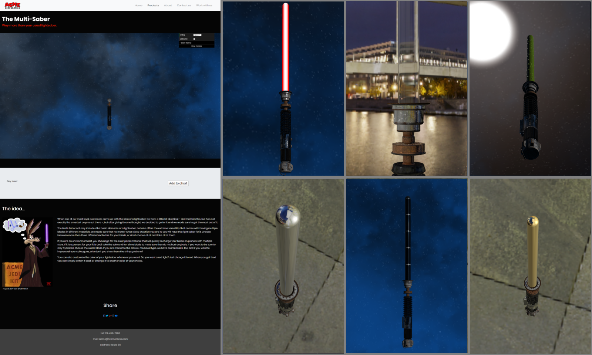

# Product Configurator - Tolusso Raffaele 138896 Anno accademico 2019/2020

## Descrizione

Il progetto consiste nello sviluppare un sito web di un prodotto in vendita includendo un visualizzatore 3D del prodotto in questione assegnandovi diversi materiali che l'utente può scegliere.
Dopo aver trovato un modello del manico di una spada laser (al sito https://free3d.com/it/3d-model/) ho deciso di fare il rendering di quest'ultimo e utilizzare la lama della spada come parte personalizzabile. Ho trovato 2 environmant map a tema, uno ambientata nello spazio (alla pagina https://www.hiclipart.com/free-transparent-background-png-clipart-dcdwa/) e l'altra ambientata in una città moderna (scaricabile gratuitamente a https://hdrihaven.com/hdri/download.php?h=modern_buildings_night&r=4k), e le ho utilizzate come ambiente. Ho scaricato le texture di materiali come Slime e pannelli solari da https://www.textures.com/. Per fare il rendering ho usato e integrato fra loro le funzioni viste nel corso che mi hanno permesso di trattare i materiali (slime e solarcells con le textures albedo, metal, ao, normal e roughness) e il modello con le loro texture e creare materiali personalizzati (laser fatto con una funzione da me definita, gold, iron e water). Spesso le texture includevano una metal map e l'albedo che ho utilizzato per ricavare cspec e cdiff seguendo i ragionamenti dell'articolo alla pagina https://marmoset.co/posts/pbr-texture-conversion/#metaltospec. Ho utilizzato Bootstrap per costruire il sito web in cui ho inserito il configuratore.

## Risultato

Il risultato è il sito seguente e alla destra vi sono degli esempi dei vari materiali in ordine: Laser, Acqua, Slime, Ferro, Pannelli Solari e Oro:

### Credits

L'immagine di willy il coyote è stata scaricata dalla pagina deviantart di [idroidmonkey](https://www.deviantart.com/idroidmonkey/art/Jedi-coyote-70656155) e quella dell'acme da http://www.revistambp.com/p526-CorporaciAn-Acme-una-marca-registrada-en-nuestra-niAez/.
