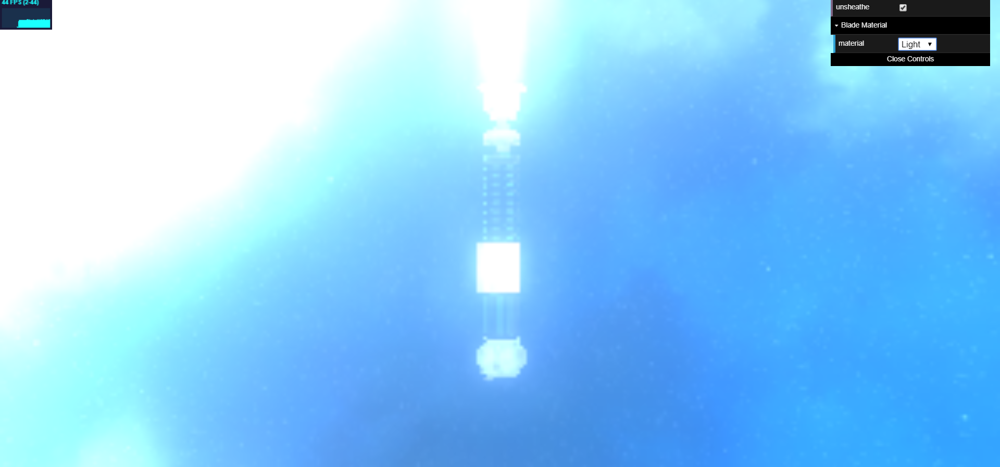
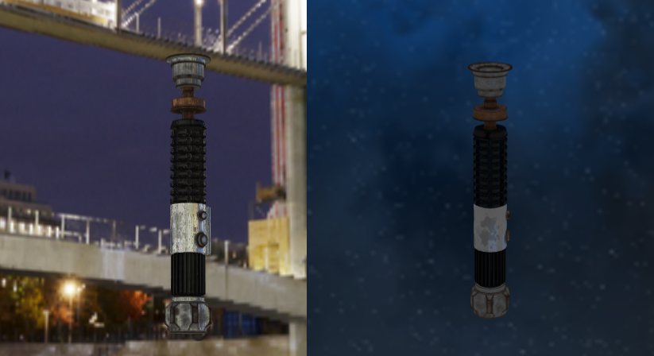
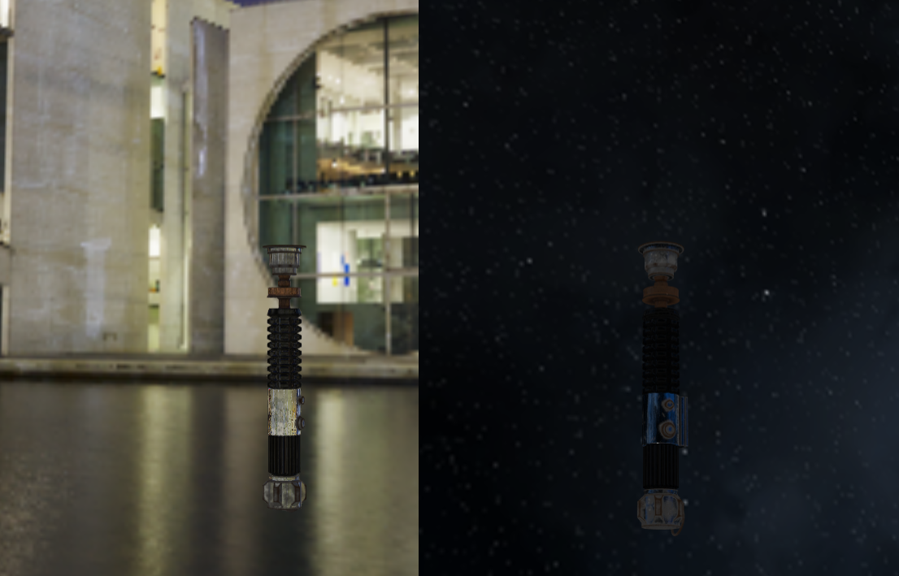

# Progetto Tolusso Raffaele 

Ho iniziato il progetto andando a cercare il soggetto che dovrà essere presentato, cercando modelli 3D sul web che potessero soddisfare le richieste principali della consegna. Ho trovato il modello del manico di una spada laser con tanto di textures per il rendering alla pagina https://free3d.com/it/3d-model/lightsabers-686170.html. Il modello non è né troppo semplice né troppo complesso a mio parere.

## Idea generale

L'idea è quella di presentare una spada la cui lama può essere fatta di diversi materiali tutti visualizzabili dal cliente, ad esempio una lama di "luce" come per ogni spada laser, ma anche ad esempio d'acqua.

## Sfondo

Ho trovato una cubemap coerente che rappresenta lo spazio con una luna alla pagina https://www.hiclipart.com/free-transparent-background-png-clipart-dcdwa/.

## Rendering Manico

Ho fatto il rendering del manico e impostato lo sfondo della scena con la cubemap e renderizzato il manico attraverso l'AO map e la funzione di rendering vista a lezione per superfici riflettenti utilizzando la roughness contenuta nella texture.

## Rendering "lama" 

Ho creato un semplice modello della lama usando blender e lo ho aggiunto alla scena.

### Materiale Acqua

Ho fatto lo shader per la versione della lama fatta d'acqua usando la funzione di rifrazione.

### Materiale Luce

Ho fatto lo shader per la classica lama "fatta di luce". Per poter creare l'effetto del laser ho prima cercato sul web possibili effetti che riproducessero l'effetto di illuminazione. Ho trovato una possibile soluzione che utilizza postprocessing chiamata "UnrealBloom". Sebbene la passata riesca ad amplificare le fonti di luce, dopo averla applicata l'intera scena perde di dettaglio e ci sono problemi con le fonti di luce sullo sfondo. 
 
Dopo aver riflettuto su come poter dare l'effetto del laser ho pensato che il colore della spada deve sempre essere "lucente" al centro quindi con una colorazione bianca per mostrare l'emissione di luce e del colore del laser ai bordi. Ho quindi pensato che una caratteristica simile nel cilindro è rispecchiata dal prodotto scalare tra la normale del vertice in tangent space e il vettore che va dalla camera al punto, in quanto sarà molto alto nei punti che hanno la normale rivolta verso la camera e sempre più piccolo nei punti che hanno una normal sempre più ortogonale al vettore della camera. Ho approfittato di questa caratteristica e una volta scelto il colore del laser basta creare un colore composto dal valore così calcolato quando questo supera il valore corrispondente e il valore corrispondente a quello del colore scelto quando questo supera il prodotto. L'effetto non è esattamente perfetto e non corrisponde esattamente all'emissione di luce, ma lo trovo in ogni caso efficace.

### Materiale Ferro

Ho utilizzato gli esempi visti a lezione per fare la lama di ferro utilizzando la cSpec specifica del materiale e il fragment shader visto a lezione.

## Cambio dell'impatto del AO nello shader del manico

Ho cambiato l'effetto del manico in modo che l'AO map abbia più effetto sulle superfici non metalliche e meno su quelle metalliche in modo che su tali superfici in cui la cdiff dovrebbe essere 0 l'effetto diffusivo venga percepito in relazione a quello speculare. Ho dovuto modificare un po' la texture in quanto parti non metalliche avevano cspec a mio parere un po' troppo alte.

## Aggiunta della luce della lama laser

Ho aggiunto una point light per simulare la luce proveniente dalla lama laser sul manico. Per evitare che questa passi oltre la superficie in cima al manico ho aggiunto il raggio di espansione alla luce e lo ho settato a un valore basso.

## City cubemap 

Ho aggiunto un'altra cubemap che rappresenta una città moderna (la più futuristica che ho trovato) dal sito https://hdrihaven.com/hdri/download.php?h=modern_buildings_night&r=4k dato che la cubemap dello spazio aveva un poco illuminazione e una più illuminata permette di mostrare meglio alcune caratteristiche del prodotto.

## Materiali Slime e Pannelli Solari

Ho trovato due materiali su TexturesCom e li ho aggiunti alle scelte renderizzandoli con lo stesso shader del manico. Sebbene siano abbastanza realistici sto pensando di aggiungere una pointlight per illuminarli meglio e togliere la combinazione tra AO e envLight che ho usato finora. I nuovi materiali e forse anche la lama potrebbero ottenere qualcosina in più.

## Componente metallica in AO

Ho pensato di attenuare l'effetto dell'AO in base a quanto un oggetto sia metallico in modo che componenti diffusive non vengano percepito o comunque vengano percepite di meno nelle parti metalliche.
 prima di aggiungere questo effetto.
 dopoaverlo aggiunto.

## Simulazione sito

Ho costruito il sito usando html e css con l'aiuto di [bootstrap](https://getbootstrap.com/) e inserito il risultato in un elemento canvas.

## Aggiunta PointLight

Ho aggiunto una pointLight per il manico e per i materiali "complessi" (quelle con texture allegate). La ho posizionata leggermente sopra il manico in una posizione che non vada a interferire con le semisfere che si vedono in modo da lasciare l'effetto di riflessione per qui punti. 

## Calcolo cspec e cdiff

Già precedentemente avevo usato calcoli aggiuntivi per sistemare i valori delle mappe Metal e Albedo in modo da rispecchiare cspec e cdiff, 
ho trovato un [articolo](https://marmoset.co/posts/pbr-texture-conversion/#metaltospec) che spiega come trasformarle utilizzando photoshop e
ho provato a utilizzare la tecnica all'interno degli shader in maniera intuitiva, non sono sicuro che siano matematicamente perfetti, ma 
almeno a livello visivo il risultato è a mio parere corretto.

## Aggiunto la PointLight a Ferro e Oro

Ho infine aggiunto la point light anche a il ferro e l'oro così da distinguerli meglio nello spazio